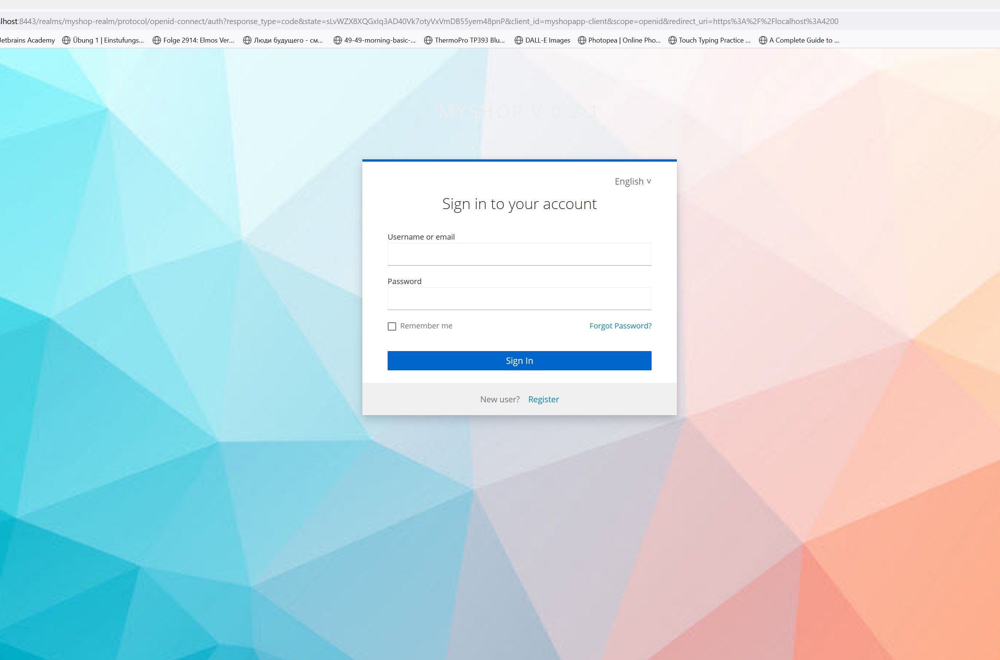

# MyShop Application

Demo final project. 
Telran IT School, Germany, 2023, Kozhushko Sergii


### Description
MyShop - web-based fullstack application for retail shops. 

The application will provide basic functionality for:
- inventory management 
- sales tracking
- customers and suppliers tracking 
- users authentication. 
It consists of:
[] Backend, developed using Spring Framework
[] Bff, backend-for-frontend. Security proxy middle layers
[] frontend, developed using Angular. 
The system supports SSL, OAuth2 for secure communication and RESTful architecture principles. 


Project description:
https://docs.google.com/document/d/1h1l6gdgCScMxxN_wndSy8YsTHeqmgm_FY1T4GQWVrIE/edit?usp=sharing

Security scheme:
https://docs.google.com/document/d/1U3Ql3_eVqkFPlnjKt8xsAzZh3lLFTWJ0a_0d1Xql3W8/edit?usp=sharing

### Screenshots



### API

Swagger API: https://localhost:8081/swagger-ui/index.html

Anonymous:

```
[GET] https://localhost:8081/api/test/anonymous
```

Admin:

```
[GET] http://localhost:8081/api/test/admin
Authorization - Bearer Token with admin privileges
```

User:

```
[GET] http://localhost:8081/api/test/user
Authorization - Bearer Token with admin or user privileges
```

<hr>
<br>


